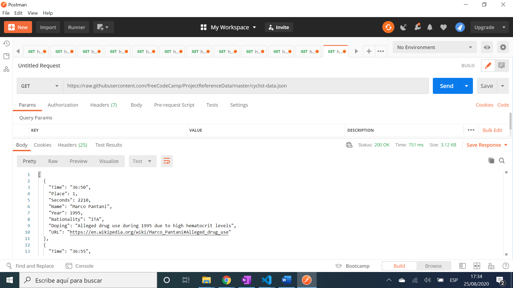

# :zap: FCC Visualisation D3 Scatterplot

* Data Driven Documents in Javascript (D3.js) library v5 used to visualise JSON data in a HTML scatterplot graph
* This was a [FreeCodeCamp Data Visualisation Project](https://www.freecodecamp.org/learn/data-visualization/data-visualization-projects/visualize-data-with-a-scatterplot-graph) for Front End Certification that is still in the FCC curriculum with the same JSON data file
* **Note:** to open web links in a new window use: _ctrl+click on link_


## :page_facing_up: Table of contents

* [:zap: FCC Visualisation D3 Scatterplot](#zap-fcc-visualisation-d3-scatterplot)
  * [:page_facing_up: Table of contents](#page_facing_up-table-of-contents)
  * [:books: General info](#books-general-info)
  * [:camera: Screenshots](#camera-screenshots)
  * [:signal_strength: Technologies](#signal_strength-technologies)
  * [:floppy_disk: Setup](#floppy_disk-setup)
  * [:computer: Code Examples](#computer-code-examples)
  * [:cool: Features](#cool-features)
  * [:clipboard: Status & To-Do List](#clipboard-status--to-do-list)
  * [:clap: Inspiration](#clap-inspiration)
  * [:file_folder: License](#file_folder-license)
  * [:envelope: Contact](#envelope-contact)

## :books: General info

* D3.js binds the [FCC JSON graph data](https://raw.githubusercontent.com/freeCodeCamp/ProjectReferenceData/master/cyclist-data.json) to the Document Object Model
* Minified D3 is loaded directly from d3js.org using: `<script src="https://d3js.org/d3.v5.min.js"></script>`

## :camera: Screenshots

.
.

## :signal_strength: Technologies

* [D3.js v5](https://d3js.org/) Data Driven Documents (D3) JavaScript library for manipulating documents based on data. Note changing to D3 v6 or v7 means tooltip mouseover and yaxis do not work and some tests fail.

## :floppy_disk: Setup

* Open 'index.html' in terminal to run program

## :computer: Code Examples

* extract from `script.js` to fetch json data from github API and extract a new date

```javascript
/*import json data using d3 v5 new method with then promise*/
d3.json(
	'https://raw.githubusercontent.com/freeCodeCamp/ProjectReferenceData/master/cyclist-data.json'
).then((data) => {
	// extract time minutes and seconds as strings from json data then
	// create a new date (1995, 1, 1, 1 are just placeholders)
	data.forEach((d) => {
		const parseMins = d.Time.slice(0, 2);
		const parseSecs = d.Time.slice(3, 5);
		d.Time = new Date(1995, 1, 1, 1, parseMins, parseSecs);
	});
```

## :cool: Features

* D3.js works with web standards so no plugins etc. required, just browser
* D3.js has a rich toolset for data-driven visuals

## :clipboard: Status & To-Do List

* Status: Working
* To-Do: Nothing

## :clap: Inspiration

* [FreeCodeCamp Data Visualisation Project](https://www.freecodecamp.org/learn/data-visualization/data-visualization-projects/visualize-data-with-a-scatterplot-graph)

## :file_folder: License

* N/A

## :envelope: Contact

* Repo created by [ABateman](https://github.com/AndrewJBateman), email: gomezbateman@yahoo.com
