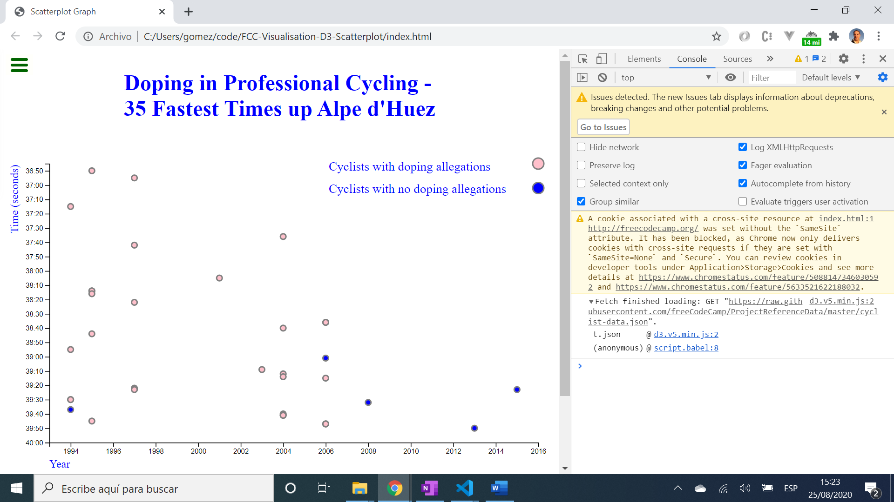

# :zap: FCC Visualisation D3 Scatterplot

* D3.js used to visualise json data in a HTML scatterplot graph
* This was a [FreeCodeCamp Data Visualisation Project](https://www.freecodecamp.org/learn/data-visualization/data-visualization-projects/visualize-data-with-a-scatterplot-graph) for Front End Certification that is still in the FCC curriculum with the same json data file

*** Note: to open web links in a new window use: _ctrl+click on link_**

## :page_facing_up: Table of contents

* [:zap: FCC Visualisation D3 Scatterplot](#zap-fcc-visualisation-d3-scatterplot)
  * [:page_facing_up: Table of contents](#page_facing_up-table-of-contents)
  * [:books: General info](#books-general-info)
  * [:camera: Screenshots](#camera-screenshots)
  * [:signal_strength: Technologies](#signal_strength-technologies)
  * [:floppy_disk: Setup](#floppy_disk-setup)
  * [:computer: Code Examples](#computer-code-examples)
  * [:cool: Features](#cool-features)
  * [:clipboard: Status & To-Do List](#clipboard-status--to-do-list)
  * [:clap: Inspiration](#clap-inspiration)
  * [:envelope: Contact](#envelope-contact)

## :books: General info

* D3.js binds the [FCC json graph data](https://raw.githubusercontent.com/freeCodeCamp/ProjectReferenceData/master/cyclist-data.json) to the Document Object Model
* Minified D3 is loaded directly from d3js.org using: `<script src="https://d3js.org/d3.v5.min.js"></script>`

## :camera: Screenshots

.
.

## :signal_strength: Technologies

* [D3.js v5](https://d3js.org/) Data Driven Documents (D3) JavaScript library for manipulating documents based on data

## :floppy_disk: Setup

* Open  'index.html' in terminal to run program

## :computer: Code Examples

* extract from `script.js` to fetch json data from github API and extract a new date

```javascript
/*import json data using d3 v5 new method with then promise*/
d3.json(
	'https://raw.githubusercontent.com/freeCodeCamp/ProjectReferenceData/master/cyclist-data.json'
).then((data) => {
	// extract time minutes and seconds as strings from json data then
	// create a new date (1995, 1, 1, 1 are just placeholders)
	data.forEach((d) => {
		const parseMins = d.Time.slice(0, 2);
		const parseSecs = d.Time.slice(3, 5);
		d.Time = new Date(1995, 1, 1, 1, parseMins, parseSecs);
	});
```

## :cool: Features

* D3.js works with web standards so no plugins etc. required, just browser
* D3.js has a rich toolset for data-driven visuals

## :clipboard: Status & To-Do List

* Status: Working
* To-Do: nothing

## :clap: Inspiration

* [FreeCodeCamp Data Visualisation Project](https://www.freecodecamp.org/learn/data-visualization/data-visualization-projects/visualize-data-with-a-scatterplot-graph)

## :envelope: Contact

* Repo created by [ABateman](https://www.andrewbateman.org) - you are welcome to [send me a message](https://andrewbateman.org/contact)
